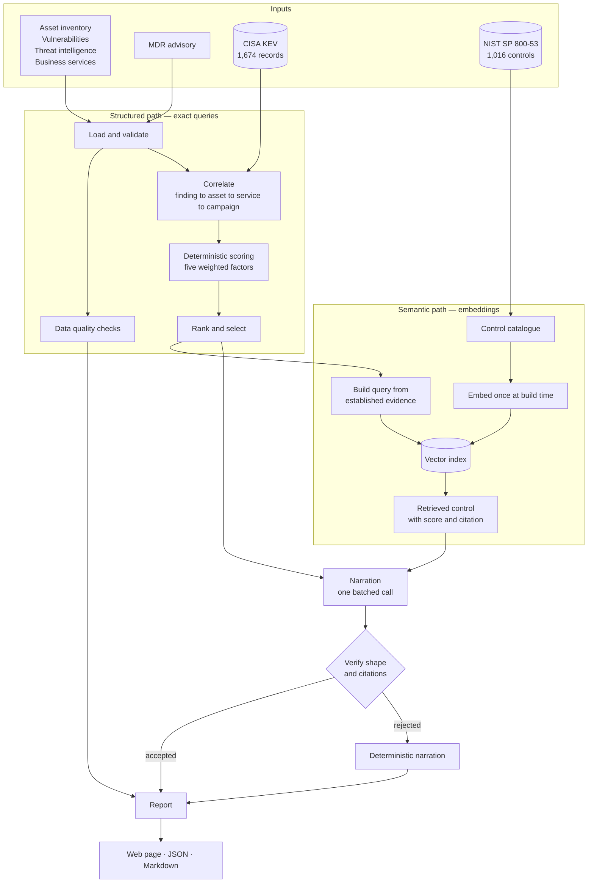

# Cyber Risk Assistant

Ranks the cyber risks in an organisation's estate by joining its asset
inventory, open vulnerabilities, threat intelligence and business service
context, cross-referencing the public CISA Known Exploited Vulnerabilities
catalogue, and retrieving remediation guidance from NIST SP 800-53 Rev. 5.

The output is a briefing a technical manager can act on: five ranked risks,
each with the asset, the finding, the campaign targeting it, the business
service at risk, a plain-English explanation of why it ranks where it does,
and the security control that applies, quoted from the catalogue.

**Ranking is not severity ordering.** A maximum-severity flaw on an isolated
development host ranks *below* a lesser flaw on an internet-facing payment
system under active attack. That behaviour is asserted directly in the test
suite rather than claimed here.

---

## Contents

- [What it does](#what-it-does)
- [Quick start](#quick-start)
- [Architecture](#architecture)
- [The data split](#the-data-split-supporting-question-1)
- [Where it goes wrong](#where-it-goes-wrong-supporting-question-2)
- [What I would change next](#what-i-would-change-next-supporting-question-3)
- [Repository layout](#repository-layout)
- [API](#api)
- [Configuration](#configuration)
- [Testing](#testing)
- [Security](#security)
- [Deployment](#deployment)
- [Assumptions](#assumptions)
- [Limitations](#limitations)

---

## What it does

Given the data pack, the system:

1. **Loads and validates** 60 assets, 114 open findings, 40 threat
   intelligence records, 20 business services and an MDR advisory. Validation
   is strict: an unknown column or an unparseable value stops the run.
2. **Reports what it cannot see** — eight data quality checks whose findings
   travel with the report rather than being logged and forgotten.
3. **Correlates** each finding with its asset, that asset's business service,
   every campaign referencing it, and its entry in the public exploited
   vulnerability catalogue.
4. **Scores** every finding against five weighted factors and ranks them.
5. **Retrieves** the applicable control from the NIST catalogue by semantic
   search, and quotes it.
6. **Narrates** each risk in plain English, from the evidence only.
7. **Renders** the result as a web page, JSON, or Markdown.

### Verified numbers from the supplied data

| | |
|---|---|
| Findings scored | 114, across 60 assets |
| Findings matched to a campaign | 45 |
| Intelligence records set aside as unrelated | 16 of 40 |
| Findings confirmed exploited in the wild | 29 |
| Findings linked to ransomware campaigns | 21 |
| Findings that **cannot** be checked against the public catalogue | 74 of 114 |
| Controls indexed | 1,016 |
| Exploited vulnerability records | 1,674 |
| Warm response time | ~9 ms |
| End-to-end run, including model warm-up | ~5 s |

---

## Quick start

Requires Python 3.10 or newer. **No API key is needed.** The ranking and the
retrieved guidance are entirely deterministic; a key only enables the
natural-language narration layer.

```bash
git clone https://github.com/Shashank231205/cyber-risk-assistant.git
cd cyber-risk-assistant

make setup     # virtual environment, dependencies, reference data, index
make run       # http://localhost:8000
```

Without `make`:

```bash
python -m venv .venv
.venv/bin/pip install -e ".[dev]"          # Windows: .venv\Scripts\pip
.venv/bin/python scripts/build_index.py    # ~2 minutes, once
.venv/bin/python main.py
```

The index build embeds 1,016 controls and takes about two minutes on first
run, mostly downloading the embedding model. It is done once.

### With Docker

```bash
docker compose up --build
```

The image builds the retrieval index at build time, so the running container
needs no network at all.

### Enabling narration

```bash
cp .env.example .env
# add GEMINI_API_KEY (free, no card: https://aistudio.google.com/apikey)
```

Providers are tried in order — Gemini, then Groq, then OpenRouter — and the
first that answers wins. If all fail, narration falls back to deterministic
templates and the report is still produced in full.

---

## Architecture



### The risk model

Five factors, weighted. The factors and their order come from the analyst
guidance in the MDR advisory itself, which is why the model is defensible
rather than arbitrary.

| Factor | Weight | What raises it |
|---|---:|---|
| Internet exposure | 25 | Reachable from the internet; no authentication required |
| Active exploitation | 22 | Listed in the public catalogue; observed campaign maturity; working exploit |
| Business criticality | 20 | Asset criticality, revenue impact, customer-facing, regulatory scope, low risk appetite |
| Ransomware association | 18 | Catalogue ransomware flag; regional campaign targeting; analyst confidence |
| Missing controls | 15 | No endpoint agent; no patch available; long unremediated; no owning team; stale record |

**Technical severity is deliberately not a factor of its own.** It
participates inside the exploitation factor with a capped share, because
severity describes how bad a flaw would be *if reached*, not whether anyone
can reach it. That cap is what produces the inversion the brief asks for.

Weights are configuration, not code, so the model can be re-tuned and
re-evaluated without a release.

### Why every score is explainable

Each factor records its weight, its normalised strength, and the specific
observations that produced it. The explanation shown to a reader is generated
*from* that evidence rather than asserted alongside it, so "why does this rank
first" always has an answer.

---

## The data split (Supporting question 1)

**Queried as structured records: the four CSV files and the KEV catalogue.**
These have known keys and known fields, and the questions asked of them have
exact answers — *is this asset internet-facing, which service does it support,
does this CVE appear in the exploited catalogue, which campaigns reference this
identifier*. An exact join answers all of them correctly. Embedding them would
convert a question with a right answer into a similarity score, introducing
error where none needs to exist, and would make the ranking impossible to
audit: nobody can explain a rank that depends on cosine distance between two
inventory rows.

**Embedded: the NIST SP 800-53 control catalogue.** It is prose, and the
vocabulary gap is the whole problem. The system establishes that a payment
gateway is internet-facing, unpatched and under active attack; the control that
answers that is titled *Flaw Remediation* and shares almost no words with it.
There is no key to join on and no exact query that finds it — the mapping from
situation to control is semantic, which is exactly what embeddings are for. The
advisory is also prose, but it is short, read once, and used as narrative
context rather than searched, so it is not embedded either.

The short version: **exact keys are queried, meaning is embedded.**

---

## Where it goes wrong (Supporting question 2)

Three specific ways this system can produce misleading output, each with what
was done about it.

### 1. A finding absent from the KEV catalogue is not thereby safe

**The failure.** The catalogue is the system's evidence for "actively
exploited". A CVE that is genuinely exploited but not yet listed will score
lower on the exploitation factor and can be ranked below something less
dangerous.

**This is not hypothetical here.** Three published CVEs in this estate are
absent from the catalogue snapshot: **CVE-2024-6387 (regreSSHion, an
unauthenticated OpenSSH remote code execution)**, CVE-2024-10978 and
CVE-2024-20358. Additionally, 74 of the 114 findings carry internally assigned
identifiers that cannot be looked up at all.

**What was done.** The system never reports "not exploited". It reports *not
assessable* for internal identifiers and *no catalogue entry found, which does
not establish that it is not exploited* for published ones — wording asserted
by a test. The proportion is surfaced as a data quality finding on every
report. The exploitation factor also draws on campaign maturity and the
scanner's exploit flag, so a finding is not solely dependent on catalogue
presence.

**What I would add.** A second corroborating source — EPSS exploit prediction
scores, or vendor advisories — so absence from one catalogue is not absence
from all of them.

### 2. Two sources disagree about exposure, and exposure is the heaviest factor

**The failure.** Internet exposure is recorded in both the asset inventory and
the vulnerability feed, and they do not always agree. Since exposure carries
the largest weight, believing the wrong one moves a finding several places.

**In this data**, exactly one finding disagrees — the vulnerability feed calls
it internal while the inventory calls the asset internet-facing.

**What was done.** The asset inventory is treated as authoritative, since it is
the system of record for the asset, and that precedence is documented and
tested. The conflict is **not silently resolved**: it is raised as a *critical*
data quality finding, shown on the affected risk entry, and stated in the
report so a reader knows the ranking rested on a contested value.

**What I would add.** A confidence penalty on contested findings, so a
disputed input visibly lowers certainty rather than only carrying a note.

### 3. An asset with no findings is indistinguishable from an unscanned one

**The failure.** 19 of the 60 assets carry no vulnerability records. They may
be clean, or they may never have been scanned. Nothing in the data
distinguishes these. A ranking built only from recorded findings cannot rank a
risk nobody has looked for, and presenting the top five without saying so
implies coverage that does not exist.

**What was done.** Assets with no findings are reported as *unknown*, never as
clean, in a dedicated data quality finding with an exact count. Stale inventory
records — three assets not seen for over 30 days — are reported separately,
since their recorded controls may no longer be accurate. Both appear under
"What this report could not see" on the report itself, not in a log.

**What I would add.** Reconciliation against the scanner's own coverage
records, so "not scanned" becomes a fact rather than an inference.

### Also guarded

- **A model inventing a control identifier.** Generated text is parsed and
  checked; a paragraph citing a control the evidence never supplied is replaced
  with the deterministic version. A fabricated identifier reads as
  authoritative and sends somebody to the wrong requirement.
- **A model overriding the ranking.** It cannot: the ranking is computed before
  any call and the model receives only assembled evidence.
- **Prompt injection through the advisory.** The advisory arrives from outside
  and is treated as data to describe, never as instructions.

---

## What I would change next (Supporting question 3)

**I would replace the retrieval probe set with a proper evaluation harness,
because right now I can measure that retrieval works but not how well.**

Retrieval quality is currently checked by five queries with unambiguous
expected controls. That set was worth building — it caught three real defects
that no amount of reading the code would have found: control statements being
silently dropped by the parser so `SI-2` had no text at all, 180 withdrawn
controls competing on title alone, and a query formulation that retrieved
adversary-deception controls instead of remediation ones. Fixing those moved
similarity for the top risks from 0.68 to 0.81.

But five probes is not a measurement. I cannot currently say what proportion of
findings receive the *right* control rather than a plausible one, and the
difference matters: a control that looks reasonable and is subtly wrong is
worse than an obvious miss, because nobody checks it. What I would build is a
labelled set covering each finding type in the estate, scored for
precision-at-1 and recall-at-5, run in CI so a change to the query, the model
or the chunking shows up as a number rather than as a vibe. I would add
groundedness scoring over the generated narration against its evidence block,
so that hallucination is measured continuously rather than caught by the one
structural check that exists today.

The reason this is the top priority over anything else on the list is that
retrieval quality is the part of this system I am least able to defend with
evidence. The ranking I can defend — it is deterministic, every factor is
attributable, and the brief's own inversion case is a test. The retrieval I
can only demonstrate anecdotally, and that is precisely the gap where a
confidently wrong answer would survive review.

---

## Repository layout

```
src/cyber_risk/
├── api/           HTTP interface: routes, response models, page rendering
├── config/        Typed settings; the only module that reads the environment
├── core/          Errors, structured logging with redaction, HTTP client
├── ingestion/     Loading, validation, data quality checks, reference corpora
├── models/        Domain entities, risk records, report structures
├── prompts/       Narration instructions, versioned as an asset
├── retrieval/     Embeddings, vector store, control retriever
├── scoring/       The deterministic risk model — pure functions, no I/O
└── services/      Correlation, provider chain, narration, orchestration

tests/
├── unit/          Isolated, no I/O
├── integration/   Crossing a component boundary
├── e2e/           The assembled application over HTTP
└── evaluation/    Scoring and retrieval quality gates

data/
├── raw/           The supplied data pack
├── reference/     Pinned CISA KEV and NIST snapshots, with a manifest
└── processed/     The generated retrieval index (not committed)

scripts/           Reference data fetch, index build, requirement sync
deployment/        Deployment notes
docs/              Additional documentation
```

**Why the layers exist.** Inner layers never import outer ones. `scoring/`
performs no I/O and imports no framework, so the entire risk model is testable
without infrastructure and cannot accidentally depend on a network call.
`models/` is the contract between ingestion and everything downstream.
`services/` owns orchestration and nothing else — every step it sequences is
implemented elsewhere and injected, so a stage can be replaced without touching
its neighbours.

---

## API

| Endpoint | Returns |
|---|---|
| `GET /` | The report as a readable page |
| `GET /report` | The report as JSON; `?limit=N` for a different count |
| `GET /report.md` | The report as Markdown |
| `GET /health` | Liveness — answers without touching the pipeline |
| `GET /ready` | Readiness — index size and configured providers |
| `GET /docs` | OpenAPI documentation |

---

## Configuration

Every setting has a working default; see `.env.example`. Nothing is required.

| Variable | Default | Purpose |
|---|---|---|
| `GEMINI_API_KEY` | *(unset)* | Enables narration; falls back to templates |
| `GROQ_API_KEY` | *(unset)* | Second narration provider |
| `OPENROUTER_API_KEY` | *(unset)* | Third narration provider |
| `EMBEDDING_BACKEND` | `local` | `local` (ONNX, no key) or `gemini` |
| `VECTOR_BACKEND` | `numpy` | Exact search; `faiss` available for scale |
| `RISK_TOP_N` | `5` | How many risks to present |
| `WEIGHT_*` | see table above | Risk factor weights |
| `RATE_LIMIT_PER_MINUTE` | `30` | Per-address request limit |
| `DEMO_ACCESS_TOKEN` | *(unset)* | Optional shared token gating the report |

---

## Testing

```bash
make test        # full suite with coverage
make check       # every gate, as CI runs them
```

**502 tests, 95% statement and branch coverage.** Ruff (19 rule families),
`mypy --strict` and Bandit all clean.

The suite makes no network calls and needs no API key: narration takes the
deterministic path, so assertions do not depend on a model's wording.

Tests worth pointing at:

- `tests/unit/test_scoring_engine.py` — the brief's inversion case, asserted
  directly, plus determinism and tie-breaking.
- `tests/unit/test_logging_redaction.py` — credentials and asset identifiers
  cannot reach a log record, including nested and in free text.
- `tests/integration/test_repository_hygiene.py` — no source file is excluded
  from the repository and no credential-bearing path is included.
- `tests/e2e/test_api.py` — the assembled application over HTTP, including
  security headers and disclosure.

---

## Security

The data is treated as a confidential asset inventory throughout.

- **Redaction is enforced by the logging pipeline**, not by call-site
  discipline. Credential-bearing fields are replaced and asset identifiers are
  masked (`payment-api-prod-01` → `pay***(19)`) so logs stay correlatable
  without reproducing the inventory.
- **Errors disclose nothing internal.** Every error carries a safe public
  message separate from its operator detail; only the safe message crosses the
  API boundary, and an unhandled exception becomes a generic response with a
  correlation identifier.
- **Response models are explicit**, so a field reaches a caller because it was
  named, never because it existed on a domain object.
- **The page runs no scripts** and is served under a content security policy
  that forbids them. Every value drawn from the data is escaped.
- **Secrets are `SecretStr`**, verified to redact in both `repr()` and
  serialisation, and are never included in an error detail.
- **The container runs as a non-root user** with no shell, a read-only root
  filesystem and all capabilities dropped.
- **CI fails if an environment file is ever tracked.** Bandit, `pip-audit` and
  Dependabot run on every change, plus a weekly scheduled audit.
- **Certificate verification is never disabled.** Where a TLS-inspecting proxy
  is present, verification is directed at the operating system trust store.

---

## Deployment

Deployed as a container. `render.yaml` describes a free-tier service; the same
image runs anywhere that accepts a container.

```bash
docker compose up --build
```

The retrieval index and both reference snapshots are baked into the image at
build time, so the running service needs no network access and cannot be
broken by an upstream source being unavailable.

CI builds the image, starts it, and asserts it serves a complete report before
any change is accepted.

See `deployment/README.md` for step-by-step instructions.

---

## Assumptions

1. **The asset inventory is authoritative for internet exposure.** It is the
   system of record for the asset; the vulnerability feed's field is a
   scan-time snapshot. Conflicts are surfaced, not hidden.
2. **Internally assigned identifiers are legitimate findings**, not data
   errors. 74 of 114 findings carry them, several named in the current
   advisory. They are ranked, and marked as not catalogue-assessable.
3. **`remediation_guidance.csv` is a cross-check, not a source.** The brief is
   explicit that it is a hint; substantive guidance is retrieved from the
   control catalogue.
4. **Assets with no findings are unknown, not clean.**
5. **Reference snapshots are pinned** for reproducibility; the retrieval date
   is shown on every report.
6. **Factor weights derive from the MDR analyst's stated priority order.**

---

## Limitations

- **Retrieval quality is demonstrated, not measured.** Five probes, not a
  labelled evaluation set. This is the top item in
  [what I would change next](#what-i-would-change-next-supporting-question-3).
- **The exact vector search is right at this corpus size and would not stay
  right.** At roughly a thousand controls an exact scan is well under a
  millisecond; at a hundred thousand it would not be. The backend is
  selectable behind one protocol, so this is a configuration change.
- **Service dependency data is present but unused.** `depends_on` describes a
  service graph that would support blast-radius scoring; only 7 of 20 services
  populate it, so the signal is too sparse to weight honestly.
- **The report is generated once at startup and cached.** Appropriate for a
  fixed data pack; a live deployment would need invalidation.
- **Free-tier hosting sleeps when idle**, so a first request after a quiet
  period may take some seconds to wake the service.
- **The data is synthetic**, prepared for assessment purposes.
